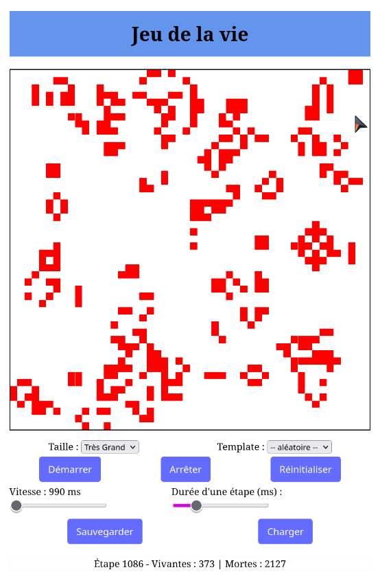

# Conway's Game of Life & Color picker & occurrence finder - TypeScript Implementation



## 📋 Description

This project is a TypeScript implementation of **Conway's Game of Life**, developed as part of an educational software architecture module. The game logic, user interface, and controls are all handled using TypeScript and HTML/CSS.

## 🚀 Features

- **Start/Stop/Reset Controls:** Manage the simulation flow easily.
- **Dynamic Grid Size:** Choose between different grid sizes (Petit, Moyen, Grand, Très Grand).
- **Speed Adjustment:** Control the simulation speed using a slider.
- **Predefined Templates:** Load patterns like Pentomino, Base, Croix, and Canon.
- **Live Editing:** Add or remove living cells when the simulation is paused.
- **Step Duration Control:** Adjust the delay of each simulation step.
- **Live Statistics:** Displays the number of living and dead cells after each evolution.
- **Save/Load State:** Save and reload specific simulation states.

## 🗂️ Project Structure

```
dom-ts-app/
├── src/
│   ├── main.ts
│   ├── conway.ts
│   ├── editeur.ts
│   ├── constantes.ts
│   └── style.css
├── images/
│   └── game_of_life_screenshot.png
├── package.json
├── tsconfig.json
└── vite.config.ts
```

**Developed with ❤️ using TypeScript.**
